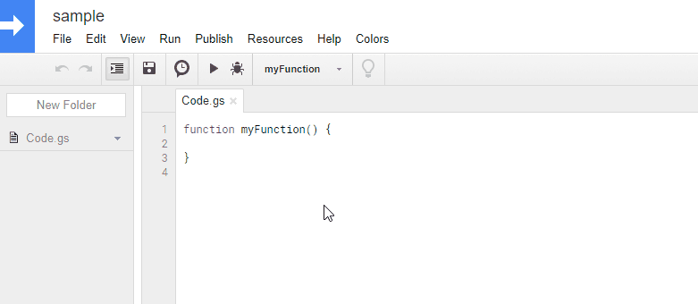

ManifestsApp
=====

# Overview
**This is a Manifests library for Google Apps Scripts. This library can be used for the projects of both standalone script type and container-bound script type.**

# Demo

In this demonstration, all scripts in a project are retrieved using ``getProjectBlob()``.

# Description
By recent update of Google, [Manifests](https://developers.google.com/apps-script/concepts/manifests) was added to Google Apps Script Project. At the moment I saw the detail, I thought that this Manifests will blow a new wind for a lot of GAS developers. So I created this. If this was useful for you, I'm glad.

And also, by recent update of Google, [Google Apps Script API](https://developers.google.com/apps-script/api/reference/rest/) was updated. By this, users got to be able to be easily to manage the GAS projects. For this, I created [ProjectApp2](https://github.com/tanaikech/ProjectApp2). This is also reflected to this library.

# Library's project key
~~~
1g0_wywpigtU_xA01D5IrRuBuDD5unieYl7nVXQR8DM_An0eUnB0NcTcx
~~~

# How to install
1. [Install ManifestsApp library](https://developers.google.com/apps-script/guides/libraries).
    - Library's project key is **``1g0_wywpigtU_xA01D5IrRuBuDD5unieYl7nVXQR8DM_An0eUnB0NcTcx``**.
1. Enable Drive API and Apps Script API at API console
    - On script editor
    - Resources -> Cloud Platform project
    - View API console
    - At Getting started, click Enable APIs and get credentials like keys.
    - At left side, click Library.
    - At Search for APIs & services, input **Drive API**. And click Google Drive API.
    - Click Enable button.
        - If it has already been enabled, please don't turn off.
    - At left side, click Library.
    - At Search for APIs & services, input **Apps script**. And click Google Apps Script API.
    - Click Enable button.
        - If it has already been enabled, please don't turn off.
1. **Also here [https://script.google.com/home/usersettings](https://script.google.com/home/usersettings) has to be enabled. Please turn ON.**

<u>Installing is done! You can use ManifestsApp.</u>

[In the case of an error related to scopes, please check here.](#QA)

### How to enable APIs directly
If you know project ID of the script that you use, you can directly access to the page to enable API using your browser.

- For Drive API
    - ``https://console.cloud.google.com/apis/api/drive.googleapis.com/?project=### project ID ###``
- For Apps Script API
    - ``https://console.cloud.google.com/apis/library/script.googleapis.com/?project=### project ID ###``

## About scopes
About the install of scopes used at this library, users are not required to install scopes. Because this library can automatically install the required scopes to the project which installed this library. The detail information about this can be seen at [here](https://gist.github.com/tanaikech/23ddf599a4155b66f1029978bba8153b).

-----

# Usage
Methods that ManifestsApp has are as follows.

| Methods | Return | Descriptions |
|:------|:------|:------|
| getManifestsRaw() | Object | Retrieve Raw Manifests data. |
| setManifestsByRaw(manifests) | Object | Set Manifests by raw data with overwrite. |
| getTimezone() | String | Retrieve Timezone. |
| setTimezone(timeZone) | Object | Set Timezone with overwrite. |
| getOauthScopes() | String[] | Retrieve OauthScopes. |
| setOauthScopes(oauthScopes) | Object | Set OauthScopes with overwrite. |
| getAdvancedServices() | Object | Retrieve AdvancedServices. |
| enableAdvancedService(userSymbol, serviceId, version) | Object | Enable AdvancedServices. |
| disableAdvancedService(serviceId) | Object | Disable AdvancedService. |
| getLibraries() | Object | Retrieve Libraries. |
| installLibrary(userSymbol, libraryId, version, developmentMode) | Object | Install Library. |
| uninstallLibrary(userSymbol) | Object | Uninstall Library. |
| getExceptionLogging() | String | Retrieve ExceptionLogging. |
| setExceptionLogging(value) | Object | Set ExceptionLogging with overwrite. |
| getWebapp() | Object | Retrieve Web App information. |
| setWebapp(access, executeAs) | Object | Set Web App with overwrite. |
| getUrlFetchWhitelist() | String[] | Retrieve UrlFetchWhitelist. |
| setUrlFetchWhitelist(urlFetchWhitelist) | Object | Set UrlFetchWhitelist with overwrite. |
| getGmail() | Object | Retrieve Gmail. |
| setGmail(resources) | Object | Set Gmail with overwrite. |

You can also see the documents at the following URL.

[https://script.google.com/macros/library/versions/d/1g0_wywpigtU_xA01D5IrRuBuDD5unieYl7nVXQR8DM_An0eUnB0NcTcx](https://script.google.com/macros/library/versions/d/1g0_wywpigtU_xA01D5IrRuBuDD5unieYl7nVXQR8DM_An0eUnB0NcTcx)

And you can see the detail structure for each parameters at the following URL.

[https://developers.google.com/apps-script/concepts/manifests](https://developers.google.com/apps-script/concepts/manifests)

## Samples
When you want to retrieve Manifests as raw data (JSON), you can use scripts like below.

~~~javascript
var ma = ManifestsApp.setProjectId(projectId); // Retrieve the instance
var r = ma.getManifestsRaw();
Logger.log(r)
~~~

or

~~~javascript
var r = ManifestsApp.setProjectId(projectId).getManifestsRaw();
Logger.log(r)
~~~

# Library used at ManifestsApp
In order to manage Manifests, it is required to access GAS projects. For this, at first, I created [ProjectApp](https://github.com/tanaikech/ProjectApp). ManifestsApp has already used ProjectApp. So you are not necessary to install ProjectApp.

-----

# Q & A
## Q1: In the case of an error related to scopes
Please confirm as follows.

### Confirmation: 1
- About the scope
    - When you see the Scopes of project installed this library (**On script editor -> File -> Project properties -> Scopes**), if there are following scopes, the reason of error is not scopes.
        - ``https://www.googleapis.com/auth/script.external_request``
        - ``https://www.googleapis.com/auth/script.projects``

### Confirmation: 2
If you cannot see above scopes at **On script editor -> File -> Project properties -> Scopes**, please do the following setting.

- [Set scopes at Manifests](https://developers.google.com/apps-script/concepts/manifests)
    - On script editor
        - View -> Show manifest file
    - Add **"oauthScopes"** to "appsscript.json". After you installed the library and added the scopes to the default "appsscript.json", it becomes as follows. This timeZone is my current time zone. <u>Of course, you can install the library by directly modifying "appsscript.json".</u>

~~~json
{
  "timeZone": "Asia/Tokyo",
  "dependencies": {
    "libraries": [{
      "userSymbol": "ManifestsApp",
      "libraryId": "1g0_wywpigtU_xA01D5IrRuBuDD5unieYl7nVXQR8DM_An0eUnB0NcTcx",
      "version": "1",
      "developmentMode": true
    }]
  },
  "exceptionLogging": "STACKDRIVER",
  "oauthScopes": [
    "https://www.googleapis.com/auth/script.external_request",
    "https://www.googleapis.com/auth/script.projects"
  ]
}
~~~

## Q2: In the case of error "Requested entity was not found."
When you set Manifests using some values, if the following error occurs,

~~~
{"error":{"code":404,"message":"Requested entity was not found.","status":"NOT_FOUND"}}
~~~

Please confirm the values again. For example, when a library with no existing ID is installed, the error occurs.

# Acknowledgements
This application was featured by [mhawksey](https://github.com/mhawksey). Thank you so much.

- The featured page is [here](https://mashe.hawksey.info/2017/11/everything-you-always-wanted-to-know-about-google-apps-script-manifest-files-but-were-afraid-to-ask/)

# Licence
[MIT](LICENCE)

# Author
[Tanaike](https://tanaikech.github.io/about/)

If you have any questions and commissions for me, feel free to tell me.

# Update History
* v1.0.0 (November 9, 2017)

    Initial release.

* v1.0.1 (November 23, 2017)

    - Added error messages.
    - Modified README.md
        - It reported that scopes used at this library can automatically install.
        - The detail information about this can be seen at [here](https://gist.github.com/tanaikech/23ddf599a4155b66f1029978bba8153b).

* v1.0.2 (January 29, 2018)

    - [ProjectApp2](https://github.com/tanaikech/ProjectApp2) is published, and got to be able to use both standalone script type and container-bound script type.
        - By this, this library also got to be able to be used for the both projects.
    - For this update, please enable Apps Script API.
        - Please check ["How to install"](#HowToInstall).

[TOP](#TOP)
